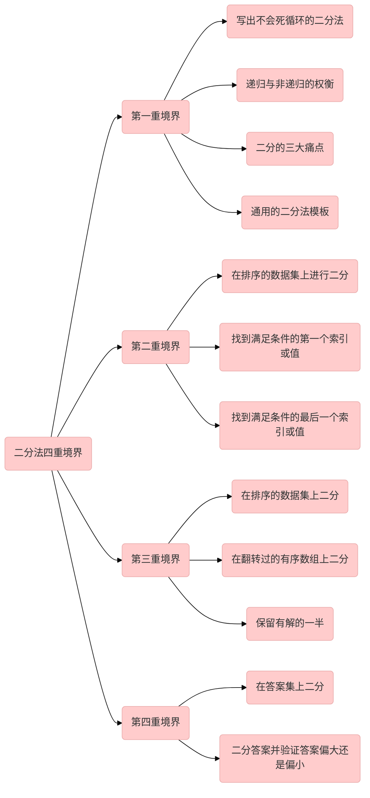

# Typora[Markdown]

打开Typora-导航栏帮助-QuickStart

# 剩余任务

- [x] ~~todolist语法~~
- [x] ~~常用emoji语法~~
- [x] ~~数学公式语法~~
- [ ] 主题

# 表格操作

| 键名       | 用途     |
| ---------- | -------- |
| ctrl+t     | 插入表格 |
| ctrl+enter | 增加一行 |


# 编辑操作

| 键名         | 用途     |
| ------------ | -------- |
| ctrl+h       | 替换     |
| ctrl+b       | 加粗     |
| ctrl+shift+i | 插入图片 |
| ctrl+k       | 插入链接 |


# 主题设置


1. 导航栏选择文件->选择偏好->选择外观->选择主题文件夹

2. 将下载好的主题文件拷贝进去
3. 重启typora即可在导航栏主题下看到新的主题


# 跳转操作

| 键名      | 用途           |
| --------- | -------------- |
| ctrl+end  | ctrl+end       |
| ctrl+home | 跳转到文章开头 |


# Html技巧

## 字

| 标签        | 用途     | 用法               |                                                     |
| ----------- | -------- | ------------------ | --------------------------------------------------- |
| font-family | 设置字体 | font-family:Tahoma | "Arial","Microsoft YaHei","黑体","宋体",sans-serif; |
| font-size   | 字体大小 | font-size:100px    | 数字、百分比                                        |
| color       | 字体颜色 | color:green        | *rgb(x,x,x)*  、*#xxxxxx*  、*colorname*            |

```js
<a style="font-family:verdana;font-size:100;color:green">算法</a>
```

效果：

<a style="font-family:verdana;font-size:80%;color:green">算法</a>


# [Mermaid绘制流程图](https://mermaid-js.github.io/mermaid/#/theming)

## 方向

| 用词 | 含义       |
| ---- | ---------- |
| TB   | top-bottom |
| BT   | bottom-top |
| RL   | right-left |
| LR   | left-right |

## 节点

| 用词         | 含义     |
| ------------ | -------- |
| `id[文字]`   | 矩形     |
| `id(文字)`   | 圆角矩形 |
| `id((文字))` | 圆形     |
| `id>文字]`   | 旗帜状   |
| `id{文字}`   | 菱形     |

## 线段

| 用词       | 含义         |
| ---------- | ------------ |
| `>`        | 加尾部箭头   |
| `-`        | 不加尾部箭头 |
| `--`       | 单线         |
| `--text--` | 单线加文字   |
| `==text==` | 粗线加文字   |
| `-.-`      | 虚线         |
| `-.text.-` | 虚线加文字   |



# markdwon使用技巧


## 插入emoji

参考[^2][^3]中的代码，在对应的类型中，找到适合自己的图例之后，直接插入编辑器即可

如：


| 类型    | 举例                             | 代码                               |
| ------- | -------------------------------- | ---------------------------------- |
| Objects | :notebook_with_decorative_cover: | `:notebook_with_decorative_cover:` |
| Nature  | :four_leaf_clover:               | `:four_leaf_clover:`               |
| Symbols | :nine:                           | `:nine:`                           |
| Places  | :cn:                             | `:cn:`                             |


## 插入todolist

语法

!>注意总共需要3个空格

```markdown
- [ ] content
```

效果

- [ ] content


## 插入行间距

| 用途   | 用法        |
| ------ | ----------- |
| 单回车 | shift+enter |
| 双回车 | enter       |

## 插入wiki索引

```markdown
basic footnote[^1]
here is an inline footnote[^2](inline footnote)
and another one[^3]
and another one[^4]

[^1]: basic footnote content
[^3]: paragraph
footnote
content
[^4]: footnote content with some [markdown]
```

效果图

参考[^1]

## 图片设置背景色

```js

```


## 图片插入图注

```html
<center>
    
    <br>
    <div style="color:orange; border-bottom: 1px solid #d9d9d9;
    display: inline-block;
    color: #999;
    padding: 2px;">
      图2-Git目录
  	</div>
</center>
```

效果图

<center>
    
    <br>
    <div style="color:orange; border-bottom: 1px solid #d9d9d9;
    display: inline-block;
    color: #999;
    padding: 2px;">
      图2-Git目录
  	</div>
</center>


## 缩放图片四种种技巧

```shell

{:class="img-responsive"}
{:height="50%" width="50%"}
{:height="100px" width="400px"}
```

## 设置字体颜色

```html
<label style="color:green">**数学日记**</label>
```

## 使用数学公式

| 文档名称                                                     | 优点                                     |      |
| ------------------------------------------------------------ | ---------------------------------------- | ---- |
| [KaTeX公式文档](https://katex.org/docs/supported.html#accents) | 网站清新，简洁，数学公式非常全，导航详细 |      |
| CTEX公式文档                                                 | 导航较为隐晦，除了数学公式外还有其他公式 |      |

## 

## markdown如何开启数学公式

?>首先开启typora支持数学公式，[1.开启行内公式模块，默认是关闭的。](https://www.dazhuanlan.com/2020/02/29/5e59eaf910c97/)：文件—>偏好设置—>Markdown,勾选内联公式，重启typora。

使用方式参考latext文档[^4]，数学公式英文版大全[^6]，数学公式中文总结文档[^5]

| 用途     | 用法                             | 效果                           |
| -------- | -------------------------------- | ------------------------------ |
| 四则运算 | `$s/s$`                          | $s/s$                          |
|          | `$\tilde{a}$`                    | $\tilde{a}$                    |
| 平方     | `$x^2$`                          | $x^2$                          |
| 下标     | ``$z=z_2$``                      | $z_2$                          |
| 根号     | `$\sqrt[n]{3}$`                  | $\sqrt[n]{3}$                  |
| 微积分   | `$\int$`                         | $\int$                         |
|          | `$\iint$`                        | $\iint$                        |
| 无穷     | `\infty`                         | $\infty$                       |
|          | `$\lim$`                         | $\lim$                         |
| 求和     | `$\sum$`                         | $\sum$                         |
| 箭头     | `$\lim_{n\rightarrow+\infty} n$` | $\lim_{n\rightarrow+\infty} n$ |
| 三角函数 | `$\sin$`                         | $\sin$                         |
| 对角函数 | `$lna^b$`                        | $lna^b$                        |
| 运算符   | `$\pm$`                          | $\pm$                          |
|          | `$\times$`                       | $a\times3$                     |
|          | `$\div$`                         | $a\div b$                      |
|          | `$\neq$`                         | $a \neq b$                     |
|          | `$\leq$`                         | $a \leq b$                     |
| 上取整   | `$\lceil a \rceil$`              | $\lceil a \rceil$              |
| 下取整   | `\lfloor x \rfloor`              | $\lfloor x \rfloor$            |


## markdown设置表格宽度

```css
| a | b | d |
|---|---|---|
| 1 | <div style="width: 150pt">very very very very very lonng long long long long text</div>| 3 |

```

!> 经过测试，设置百分比不生效,原因未知

```css
<div style="width: 150pt">  <div style="width: 50%">  ..
```


## markdown如何换行

markdown表格内换行需要使用`<br>`

## markdown如何开启数学公式

?>首先开启typora支持数学公式，[1.开启行内公式模块，默认是关闭的。](https://www.dazhuanlan.com/2020/02/29/5e59eaf910c97/)：文件—>偏好设置—>Markdown,勾选内联公式，重启typora。

使用方式参考latext文档[^4]

| 用途  | 用法    |
| ----- | ------- |
| $s/s$ | `$s/s$` |
|       |         |
|       |         |
|       |         |


## markdown设置字体颜色

**HTML方式：**

```css
　<font color='red'> text </font>
```

效果：　<font color='red'> text </font>

**KaTex/MathJax方式:**

```css
$\color{red}{红色字}$
```

效果：$\color{red}{红色字}$

## markdown如何等比缩放图片

在img标签里面只设置宽，不设置高，图片就会等比例缩放。


[^1]: [生成论文式索引](http://idolcoder.gitee.io/quickshortkey/#/hexo?id=生成论文式索引)
[^2]: [Full Emoji List, v13.1 (unicode.org)](http://www.unicode.org/emoji/charts/full-emoji-list.html)
[^3]: [EMOJI CHEAT SHEET]([🎁 Emoji cheat sheet for GitHub, Basecamp, Slack & more (webfx.com)](https://www.webfx.com/tools/emoji-cheat-sheet/))
[^4]: [CTEX - 在线文档 - 数学公式](http://www.ctex.org/documents/packages/math/index.htm)
[^5]: [markdown最全数学公式速查](https://blog.csdn.net/jyfu2_12/article/details/79207643)
[^6]: [英文版数学公式速查](https://katex.org/docs/supported.html#accents)

